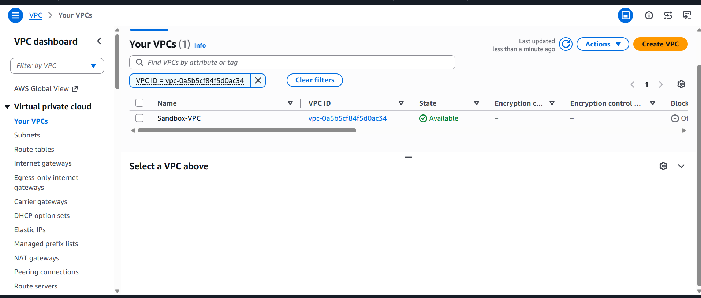
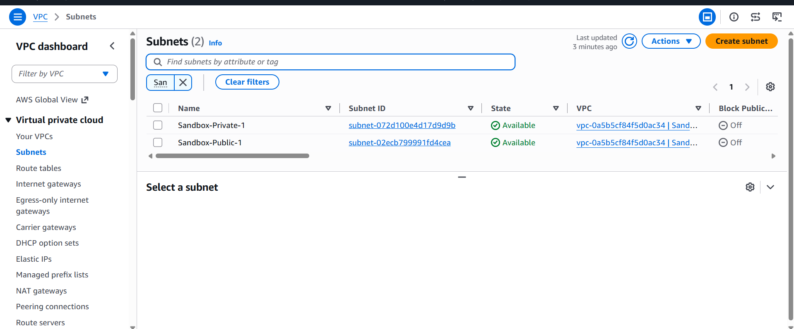
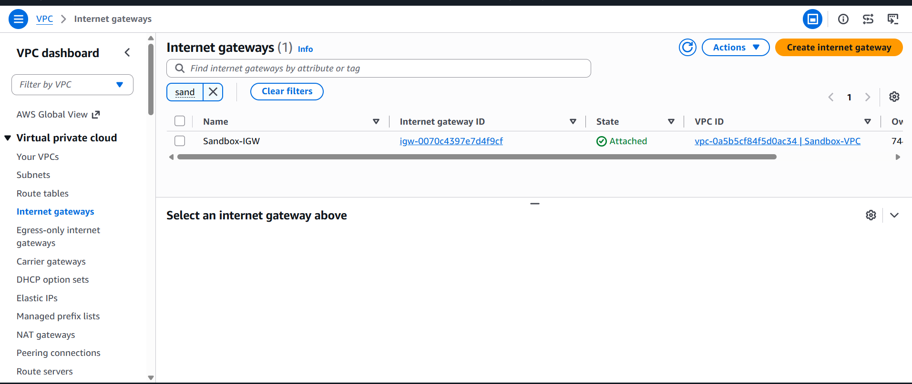
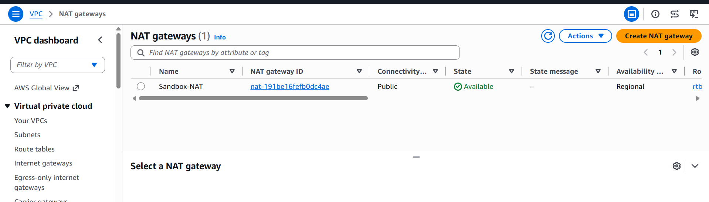
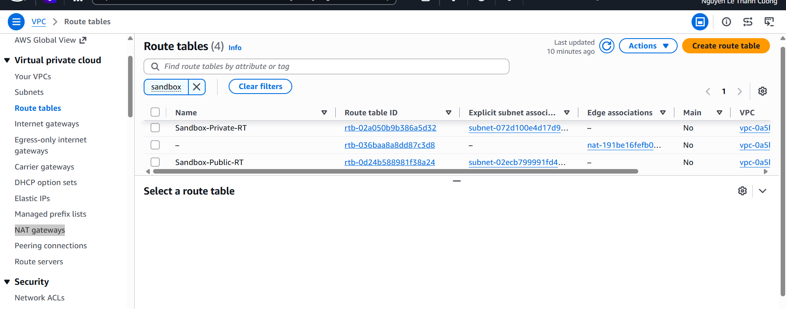
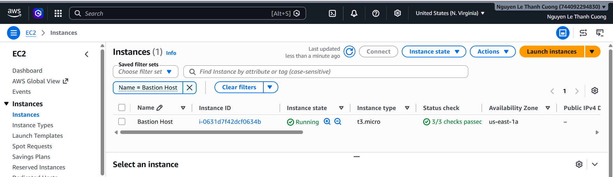
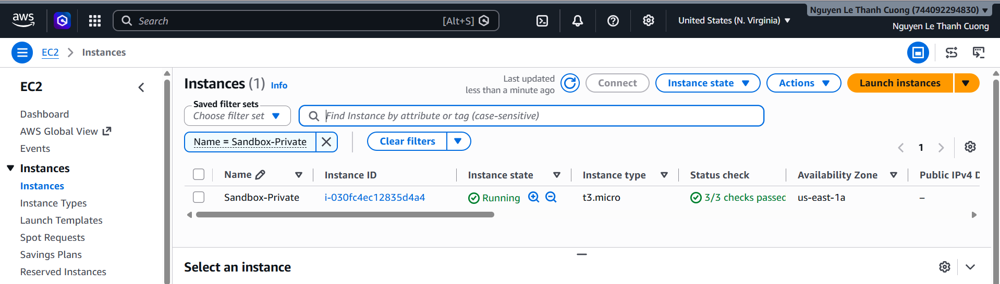
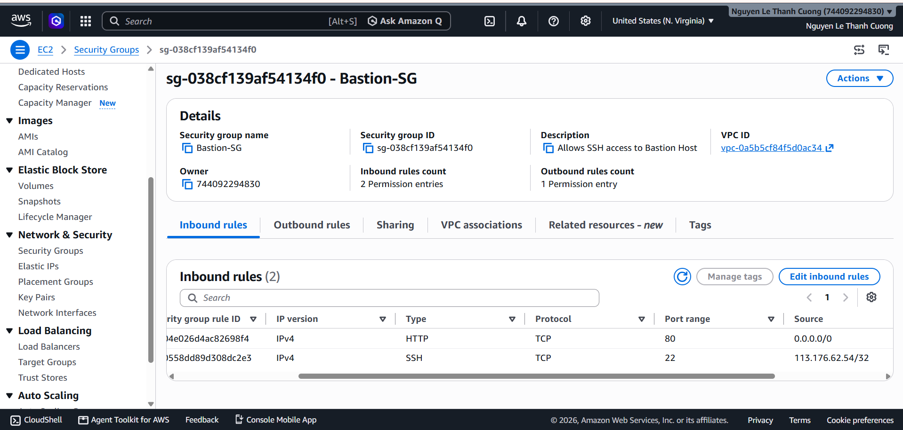
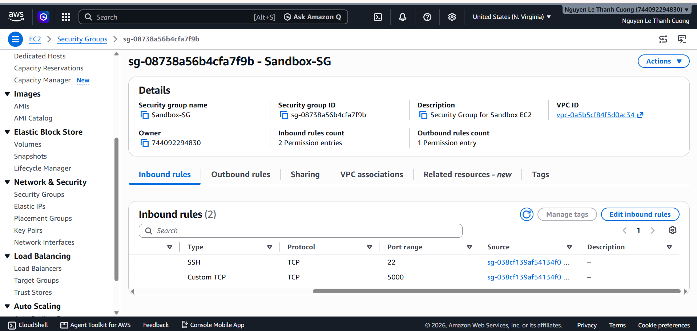
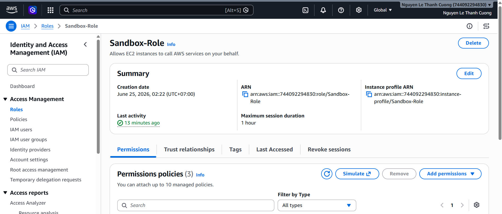

### Preparing Network Infrastructure

#### Create VPC

#### Create public and private subnets

#### Create Internet Gateways

#### Create NAT Gateway

#### Create Route Table

### Preparing EC2 Instances

#### Create two EC2 instances:

Bastion Host (Public Subnet)

AI Server (Private Subnet)

### Preparing Security Groups

Configure Security Groups for the EC2 instances.

Bastion Host (Public Subnet)

AI Server (Private Subnet)

### Preparing IAM Role

Create IAM Role

