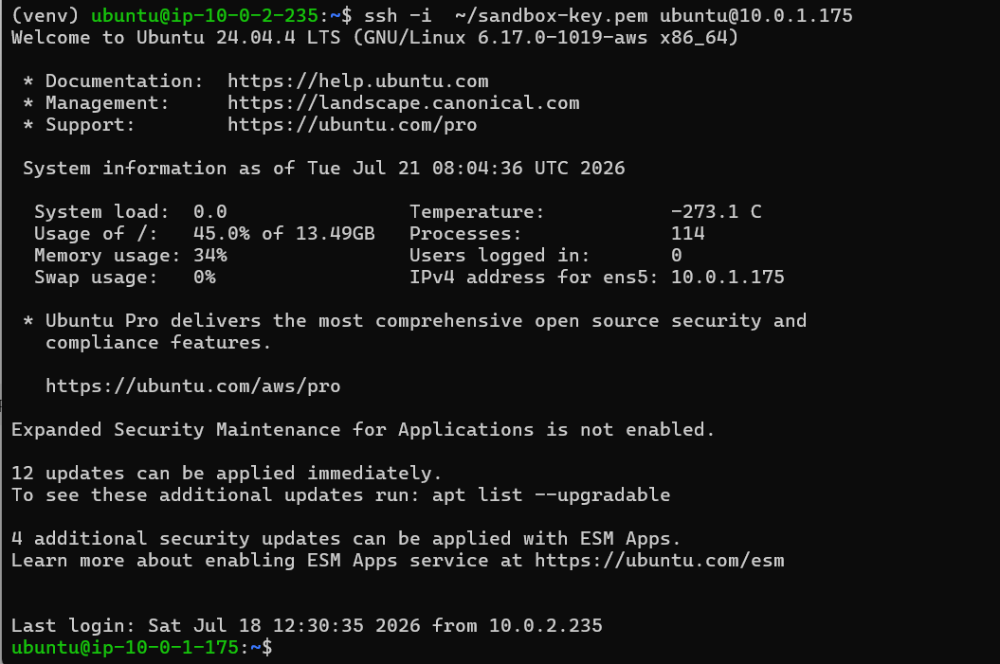
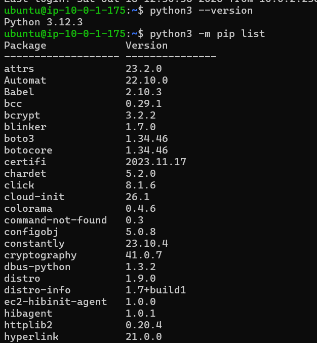
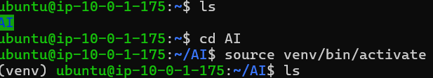
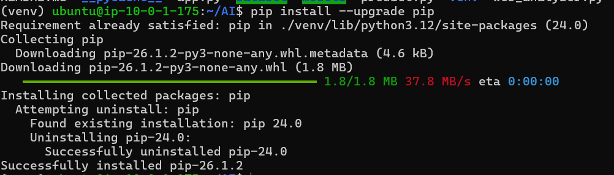
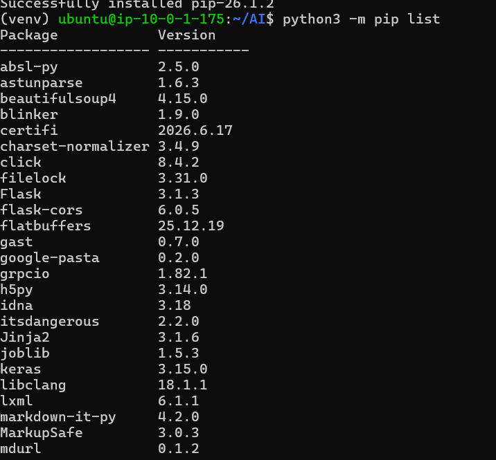
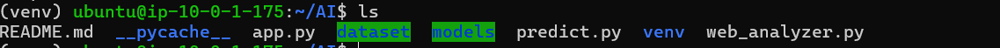
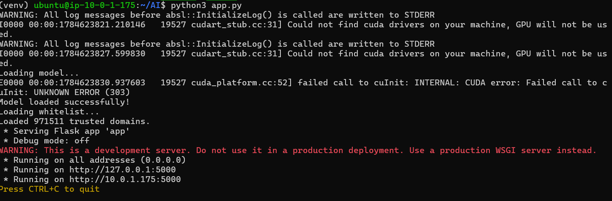

### Kết nối từ Bastion Host đến Sandbox

### Kiểm tra đã cài python và thư viện cho sandbox

- Sau khi kết nối thành công thì sẽ rõ lệnh tiếp theo là cập nhật hệ thống: **sudo dnf update -y**

- Kiểm tra python nếu chưa có thì dùng lệnh để cài: **sudo dnf install python3 -y**

- Kiểm tra pip nếu chưa có thì dùng lệnh để cài: **sudo dnf install python3-pip -y**

### Tạo thư mục AI và kích hoạt môi trường

- Dùng lệnh **mkdir ai-server** để tạo thư mục

- Dùng lệnh **python3 -m venv venv** để tạo môi trường

- Dùng lệnh **source venv/bin/activate** để kích hoạt môi trường ảo

### Nâng cấp pip 

### Cài thư viện trong thư mục AI

- Dùng lệnh **pip install flask** để cài flask

- Dùng lệnh **pip install tensorflow** để cài TensoFlow

- Dùng lệnh **pip install numpy** để cài Numpy

- Dùng lệnh **pip install pandas** để cài Pandas

- Dùng lệnh **pip install scikit-learn** để cài sclikit-learn

- Dùng lệnh **pip install requests** để cài Requests

- Dùng lệnh **pip install beautifulsoup4** để cài BeautifulSoup

### Tải source code vào Sandbox

- Up source từ máy ảo -> EC2 public -> sandbox

- Bước đầu dùng lệnh **scp -i "C:\Users\ASUS\Downloads\sandbox-key.pem" -r AI_Project ubuntu@44.214.180.89:~** để up lên bastion host rồi vào bastion thì sau đó copy code qua sandbox bằng câu lệnh scp -i ~/sandbox-key.pem -r AI_Project ec2-user@10.0.1.xxx:~

### Khởi chạy môi trường

