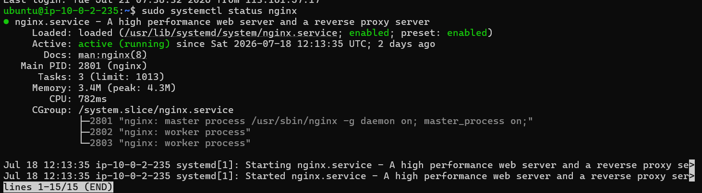
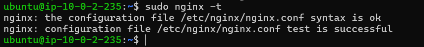
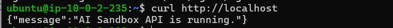

### Introduction
- In this section, you will install and configure Nginx on the Bastion Host to act as a reverse proxy. Nginx will receive requests from AWS Lambda and forward them to the Flask API running on an EC2 instance within the private subnet. Using a reverse proxy protects the AI ​​server from direct Internet access while enhancing security and system manageability.

### Implementation Steps

+ Install Nginx:
    + First, update the software package list using the command **sudo apt update**
    + Then, run the command **sudo apt install nginx -y**
+ Check the Nginx status; if it shows as "active (running)," the installation was successful.
 

### Configuring the Reverse Proxy

- Use the command **sudo nano /etc/nginx/sites-available/default** to open the configuration file.

```nginx
server {
    listen 80;
    server_name _;

    location / {
        proxy_pass http://10.0.1.xxx:5000;
        proxy_set_header Host $host;
        proxy_set_header X-Real-IP $remote_addr;
        proxy_set_header X-Forwarded-For $proxy_add_x_forwarded_for;
    }
}
```
- Verify the configuration.


- After modifying the configuration, use the command **sudo systemctl restart nginx** to apply the changes.

- Check the service status.
 

### Testing the Reverse Proxy

- Running the command **curl http://localhost** and seeing the AI ​​sandbox running indicates success.




