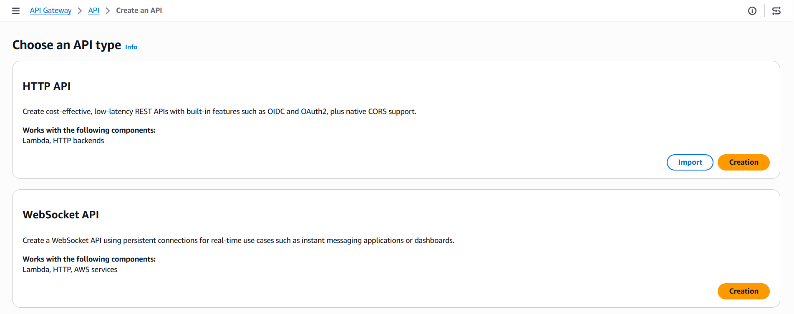
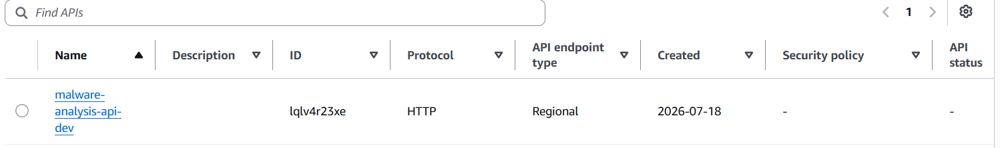
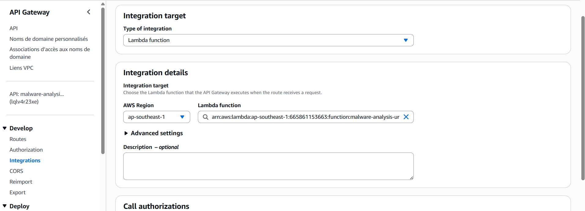
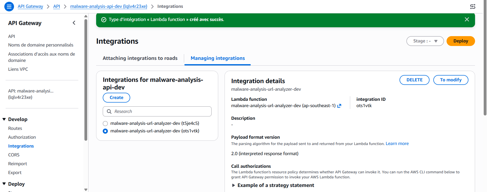
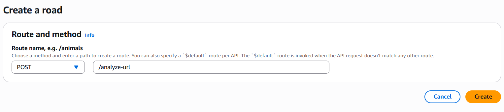
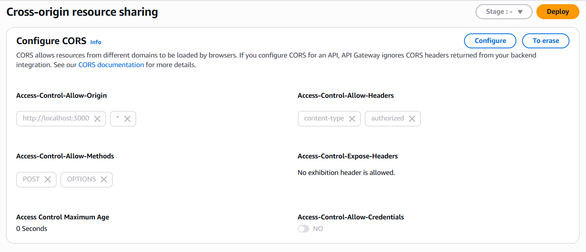
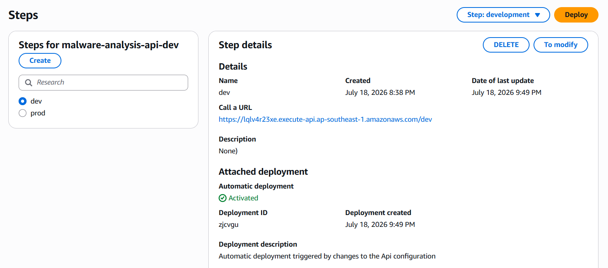
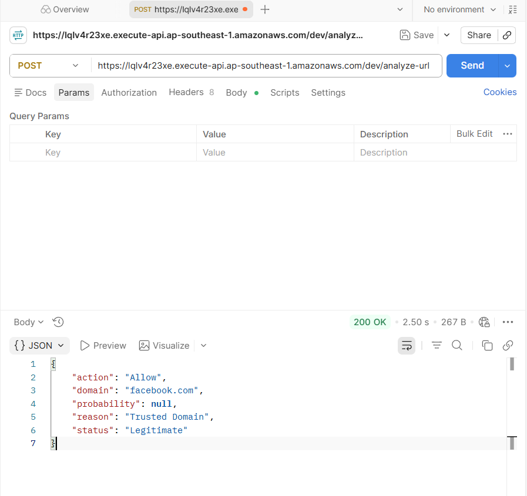

### Giới thiệu

- Trong phần này, bạn sẽ tạo và cấu hình Amazon API Gateway để cung cấp một API công khai cho ứng dụng React. API Gateway tiếp nhận URL từ giao diện người dùng, chuyển yêu cầu đến AWS Lambda và trả kết quả phân tích từ mô hình AI về lại cho ứng dụng.

### Truy cập Amazon API Gatewway

- Chọn create API

### Tạo HTTP API 

- Chọn **build -> Nhập tên API -> Review and create -> Create**

### Tạo Integration với AWS Lambda

- Điền thông tin liên kết với Lambda

- API Gateway được liên kết với Lambda Function

### Tạo Route cho API

- Chọn **route -> create**

### Cấu hình CORS

### Kiểm tra Stage

### Kiểm tra API Gateway

- Kiểm tra trên postman

- Nhập đường link **https://lqlv4r23xe.execute-api.ap-southeast-1.amazonaws.com/dev/analyze-url**

- postman trả thông số như trên hình là thành công