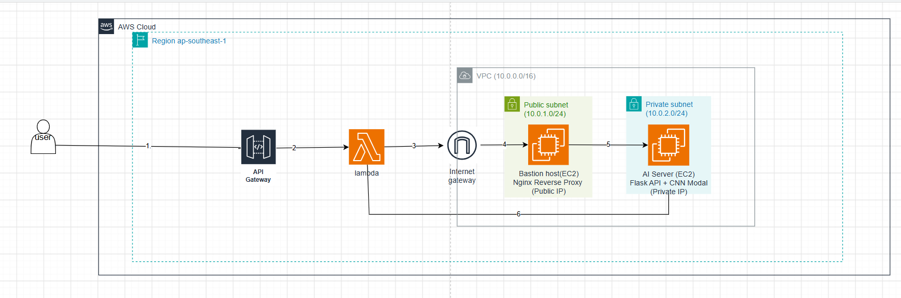

#### Giới thiệu về hệ thống phân tích URL độc hại trên AWS

+ Trong workshop này, hệ thống được xây dựng nhằm mô phỏng quy trình triển khai một ứng dụng thực tế trên nền tảng Amazon Web Services (AWS). Hệ thống sử dụng kiến trúc kết hợp giữa các dịch vụ AWS và mô hình trí tuệ nhân tạo (AI) để phân tích và phát hiện các URL có dấu hiệu lừa đảo (Phishing).

+ Ứng dụng được triển khai theo mô hình nhiều tầng, trong đó giao diện người dùng được xây dựng bằng React, yêu cầu phân tích được xử lý thông qua Amazon API Gateway và AWS Lambda, sau đó chuyển tiếp đến máy chủ AI chạy Flask trên Amazon EC2 để thực hiện dự đoán và trả kết quả về cho người dùng. Kiến trúc này giúp hệ thống dễ dàng mở rộng, tăng tính bảo mật và giảm tải cho các thành phần xử lý.

#### Tổng quan

+ Thiết kế hạ tầng mạng trên AWS bao gồm VPC, Public Subnet, Private Subnet, Internet Gateway, NAT Gateway và Route Table.

+ Triển khai Bastion Host và EC2 trong Private Subnet để đảm bảo mô hình mạng an toàn.

+ Cấu hình Security Group và IAM Role cho các tài nguyên AWS.

+ Triển khai ứng dụng AI sử dụng Flask trên EC2 để phân tích URL.

+ Cấu hình Nginx Reverse Proxy để chuyển tiếp yêu cầu từ Bastion Host đến máy chủ AI.

+ Xây dựng AWS Lambda và API Gateway để kết nối Frontend với hệ thống AI.

